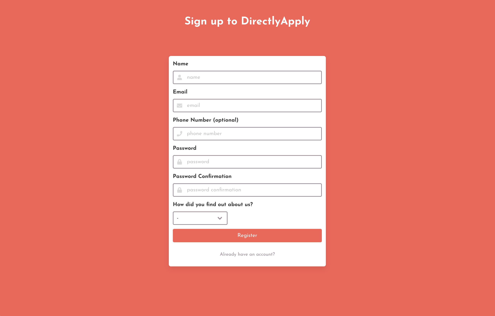

# Register form, built using React

## Technologies used:

- React
- React-routerdon
- SASS
- Bulma
- FontAwesome

## Code installation:

- clone or download the repo
- install dependancies `npm i`
- start the development server `npm run start`
- navigate to http://localhost:3000/register 

# Brief

- Create a webpage with a signup form
- Add a drop down with the label “How did you find out about us”, include 3-4 options
- Style it how you wish
- Form Validation. Make sure that the user has filled in all the fields, that the email is an actual email and that both passwords match. If something is wrong, tell the user what’s wrong
- When the signup button is clicked, collect the info into an object and output to the console.
- Upload to github

## Approach:

I spent some time over the weekend thinking about my approach to this challenge. I decided to use React Hooks to create the page. I have built my most recent two projects using this and wanted to continue learning and solidifying the tool. I used the Bulma CSS framework as again I have found this a very useful tool when creating forms and for responsive design. I decided to spend a maximum of 3 hours on this build and decided to split the time into the following 30 minute sections.

- 0-30 - initial set up and getting a single form input submitting and console logging the users input
- 30-60 - building out the form into reusable hook components, adding change and submit functionality
- 60-90 - adding styling and links to login page
- 90-120 - working on form error handling
- 120-150 - neatening up code
- 150-180 - completing readme

## Wins 
I managed to get a nice looking and responsive form which would submit and console log the users data if inputted correctely.

## Challenges/Bugs:
- The error handling took me a fair bit longer than expected and I still haven't got it working. I am currently having issues with the updating of state and there being a delay in the setting of the state to release the formData to the console.log. Without the error handling the formData is console logged correctly. However, with the error handling it takes a couple of clicks before the state is set correctly and the data is logged.

I only managed to get the errors logging to the console rather than updating the user on the form. 

Usually I would have built the backend to handle any form errors. Upon the request of registering from the user the backend would shoot out any errors. 

## If I had more time...:
I would get the above state timing issue fixed first and foremost. Once this is complete I would then adjust the form to show the applicable errors. 

# Final Product:

